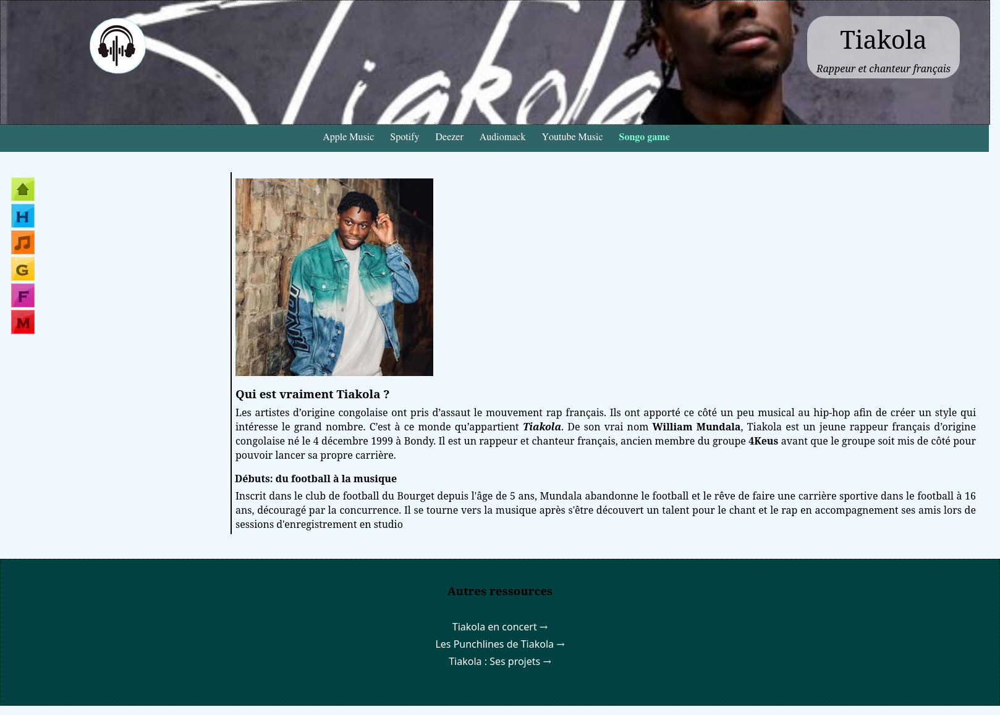
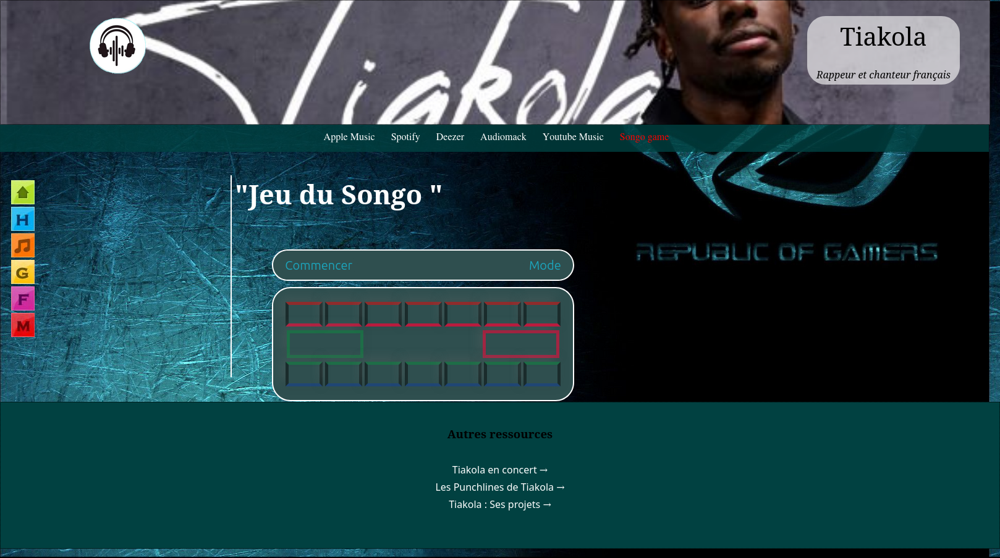

# 🎤 Site Vitrine de Tiakola & Jeu du Songo 🎮 
       
 ---

Bienvenue sur le **Site Vitrine de Tiakola**, un projet web mettant en avant la bibliographie de l'influenceur **Tiakola**. En complément, le site intègre également un **jeu du Songo** interactif !

## 🌐 Aperçu du Projet 
Ce site propose différentes sections dédiées à **l’univers de Tiakola**, incluant :  
- 🏠 **Page d'accueil** : Présentation générale  
- 🎬 **Films** : Référencement des films préférés de Tiakola  
- 🎵 **Musique** : Sa discographie et ses collaborations  
- 🍽️ **Gastronomie** : Les plats favoris de l’influenceur  
- 👕 **Habillement** : Son style vestimentaire et ses inspirations  

Le projet intègre également le **jeu traditionnel africain du Songo**, permettant aux utilisateurs de s’amuser tout en découvrant une part de la culture africaine.  

---

## 🚀 Démo en ligne 
🔗 [Lien vers le site](https://example.com) *(ajoute l’URL de ton site ici)*  

---

## 🛠️ Technologies utilisées 
Le projet repose sur les **technologies web standards** :  

- **HTML** - Structure des pages  
- **CSS** - Mise en forme et animations  
- **JavaScript** - Interactivité et logique du jeu  

---

## 📂 Structure du projet 

    /influenceur-songo
    ├── /css           # Fichiers de styles CSS
    ├── /images        # Ressources graphiques et images
    ├── /others        # Fichiers multimédia
    ├── Accueil.html     # Page d'accueil
    ├── Film.html     # Section dédiée aux films
    ├── Gastronomie.html  # Section gastronomie
    ├── Habillement.html  # Page sur l'habillement
    ├── Marque.html   # Section marque
    ├── Musique.html   # Section musique
    ├── README.md      # Documentation du projet
    ├── songo.js     # Fichier javascript du jeu du songo
    ├── Songo game.html     # Page du jeu du Songo

----------

## 🎯 Fonctionnalités

✅ **Site responsive** : Adapté aux mobiles, tablettes et ordinateurs  
✅ **Effets d’animation CSS** : Transitions et hover effects  
✅ **Jeu du Songo interactif** : Développé en **JavaScript pur**  
✅ **Galerie multimédia** : Images et vidéos intégrées  
✅ **Navigation fluide** : Expérience utilisateur optimisée

----------

## 📸 Captures d’écran

#### Page d'accueil

#### Page du jeu du Songo

----------

## 📦 Installation et Utilisation

### 1️⃣ Cloner le projet
    `git clone https://github.com/johanalain11/influenceur-songo.git` 
    
### 2️⃣ Ouvrir le fichier `Accueil.html** dans un navigateur
### 3️⃣  Profiter du site ! 🎉

----------

## Améliorations Futures
>[!NOTE]
>
>* Mettre à jour les informations de l'influenceur
>* Ajouter la fonctionnalité de jeu du songo en ligne

## Auteur
**Johan Alain**

[GitHub](https://github.com/johanalain11/)

## 📜 Licence

📝 Ce projet est sous licence **MIT**.

----------

✨ **N’hésite pas à contribuer !**  
💡 **Suggestions et retours sont les bienvenus !** 😊  
📩 **Contact :** [LinkedIn](www.linkedin.com/in/johanalain11) | Email [jank092016@gmail.com](mailto:jank092016@gmail.com)

